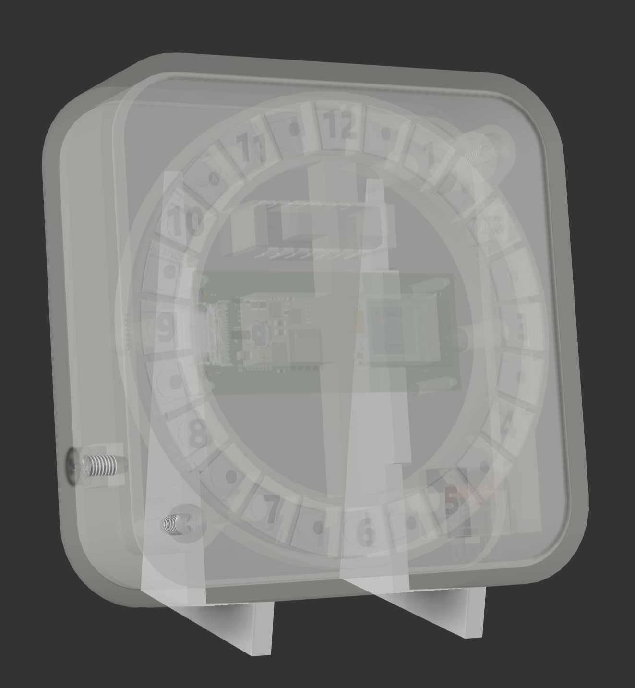
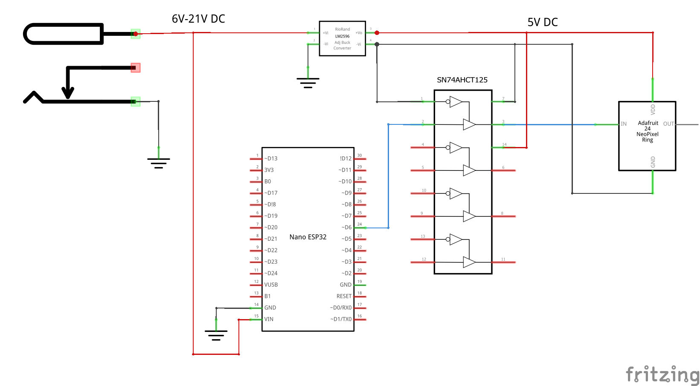

# carbon-intensity-clock
A clock that shows when the next forecast window is for the greenest energy in the UK.

# Usage

The clock will automatically determine the current UK time (adjusted for Daylight Savings as appropriate). This will be shown in blue. From that point onwards, the next full rotation of 12 hours will show in varying shades of green or red when it is best to use electricity in your location based on what the forecast carbon usage at that time will be. i.e. If it's more green, there's more renewable energy on the grid. If it's more red, there's a higher proportion of fossil fuels being burnt to supply the grid. Each block on the clock is a 30 minute segment. Set your dishwasher / washing machine / other delayable electricty using process to start and finish in as green a window as you can!

# Requirements

The following raw materials, components and tools are required to build this.

## Bill of Materials
- For 3D printing:
  - PLA filament (white)
- For laser cutting:
  - 0.5mm thick transparent acrylic sheet ~ 80x80mm
  - 0.5mm thick translucent acrylic sheet ~ 80x80mm
    - Or use more transparent and a "frosting spray" to make it translucent
  - 0.5mm thick opaque white ABS sheet ~ 80x80mm
- 3mm domed screws, 6mm long (head is assumed to be 5mm diameter or less, and 2mm high or less) x4
- [2.1mm jack power socket](https://uk.farnell.com/wurth-elektronik/694108301002/connector-power-entry-jack-3a/dp/2472153)
- [Arduino Nano ESP32 Board](https://uk.rs-online.com/web/p/arduino/2686963)
- [5V 3A Buck Convertor](https://thepihut.com/products/ubec-dc-dc-step-down-buck-converter-5v-3a-output?variant=27739329617)
- [74AHCT125 - Quad Level-Shifter (3V to 5V)](https://thepihut.com/products/74ahct125-quad-level-shifter-3v-to-5v?variant=27739617873)
- Some 22 AWG (minimum) cable to connect everything together
- A 2.1mm jacked DC power source able to supply at least 9W at between 6 and 21V with the positive voltage supplied on the pin. 

## Required Tools
- 3D Printer (At least 80x80x22mm build volume)
- Laser Cutter (Powerful enough to cut 0.5mm thick ABS + Acrylic) - if you don't have access to one, then there are various online laser cutting services that you could send the files to to have them cut for you.
- Soldering Iron + accessories
- PZ2 screwdriver
- Plastic solvent, e.g. Tensol 12 for sticking the acrylics and ABS together

# Build Instructions

It's _much_ easier to do the software build and upload _before_ the Nano is integrated in to the clock, so I strongly recommend following the Software instructions first, before doing any assembly.

## Software
- Note: This project was created on VS Code using Platform I/O so easiest to load it up in that. You could build it in the Arduino IDE but you'd need to tweak it and get the appropriate libraries.
- Rename `exampleWifiCredentials.h` to `wifiCredentials.h` and populate it with your WiFi network name and password.
- In `main.cpp` update the `POST_CODE` constant to the start of your post code (since the grid's electricity supply is different in different parts of the country).
- Build and upload to the Arduino Nano ESP32.

## Hardware
### Manufacture
- 3D Print the following in white PLA (or whatever you want to print it in frankly!). NOTE: This is has been designed so that all components can be printed with no supports and no post-print cleanup required.
  1. Thing
  2. Thing 2
- Create the face plate:
  - Laser cut the following
    1. Thing
  - If you're not cutting translucent acrylic then frost spray the top of all of the pieces cut from number 1 now.
  - Glue the largest piece of 3 to 2 (the face base)
  - Glue all of the translucent pieces (1) in the correct slots
  - Fill in the holes by gluing in the remaining pieces from 3

### Electronics

- Connect up all the electronic components (ignore the part label for the buck convertor on the schematic above - I couldn't find that specific buck convertor on Fritzing)
  - 

### Assembly
